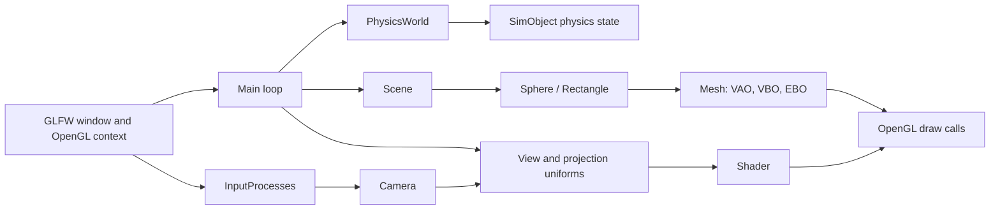

# Basic Renderer and 3D Engine

> A Visual Studio–based C++ OpenGL renderer template featuring basic 3D rendering, a free-look camera, primitive meshes, lighting, and a lightweight physics simulation.

<!-- Add project screenshots or GIFs below this line. -->
<!-- Example:  -->

## Overview

This repository is a starting point for future graphics and interactive 3D projects. It provides a compact rendering foundation built around **C++**, **OpenGL**, **GLFW**, **GLAD**, and **GLM**, with an example scene that simulates spheres falling, bouncing, and colliding with a ground plane.

### What you will find here

- **OpenGL 3.3 Core** rendering setup with a GLFW window and GLAD function loading.
- **Camera and input system** with mouse look, scroll-to-zoom, and six-direction movement.
- **Reusable rendering abstractions** for shaders, vertex buffers, index buffers, vertex arrays, meshes, textures, and draw calls.
- **Procedural primitives**, currently including `Sphere` and `Rectangle` geometry.
- **Shader-based lighting** using material and light uniforms.
- **Scene objects** that join drawable geometry, material data, and a physics body.
- **Basic physics** with gravity, Euler integration, sphere–sphere collision, sphere–AABB collision, positional correction, and restitution-based bounce response.
- **An example simulation** in `Application.cpp` with two dynamic spheres and a static ground surface.

> **Platform note:** This project is currently configured for **Windows and Visual Studio**. It has not been prepared or tested as a cross-platform build.

## How It Works

Each frame, the application processes user input, updates the camera, advances the physics world, uploads camera and lighting data to the shader, and draws every object in the scene.



At startup, `Application.cpp` creates an OpenGL window, camera, renderer, scene, physics world, and shader. The example then adds two spherical objects and a large rectangle used as the ground. `PhysicsWorld` applies gravity, integrates object movement, resolves supported collisions, and resets accumulated forces. The `Scene` draws each `SimObject` using its mesh, transform, and material.

## Running the Program

### Requirements

- Windows
- Visual Studio with the **Desktop development with C++** workload installed
- A GPU and driver supporting **OpenGL 3.3 Core**
- The project dependencies referenced by the Visual Studio solution, including GLFW, GLAD, and GLM

### Install and build

1. Clone the repository:

   ```bash
   git clone https://github.com/<Ghassane-Nouijai>/<Basic-Engine>.git
   ```

2. Open the repository's Visual Studio solution file (`.sln`).
3. Select the intended build configuration, typically `Debug` or `Release`, and the matching platform, typically `x64`.
4. Ensure the startup project is set to the renderer application.
5. Build the solution with **Build → Build Solution**.
6. Run it with **Local Windows Debugger** or press `F5`.

### Controls

| Input | Action |
| --- | --- |
| `W` / `S` | Move camera forward / backward |
| `A` / `D` | Move camera left / right |
| `Space` | Move camera upward |
| `Left Shift` | Move camera downward |
| Mouse movement | Look around |
| Mouse wheel | Zoom in / out |
| `Esc` | Close the application |

The cursor is captured while the program runs so mouse movement controls the camera view.

## Developer Guide

### Getting the source

Fork the repository if you want your own remote copy, then clone it locally:

```bash
git clone https://github.com/<Ghassane-Nouijai>/<Basic-Engine>.git
cd <your-repository>
```

Open the `.sln` file in Visual Studio and build using the configuration expected by the project. If Visual Studio cannot locate third-party headers or libraries, check the project properties for **Include Directories**, **Library Directories**, and **Additional Dependencies**. Keep the dependency architecture consistent with your build target for example, use `x64` libraries when building for `x64`.

### Project structure

The code is organized into small, focused components:

| Area | Main files / types | Responsibility |
| --- | --- | --- |
| Application | `Application.cpp` | Creates the window, initializes OpenGL, owns the main loop, and configures the demo scene. |
| Rendering core | `Renderer`, `Shader`, `VertexArray`, `VertexBuffer`, `IndexBuffer` | Wraps common OpenGL resources, shader compilation, uniforms, and indexed drawing. |
| Geometry | `Mesh`, `Sphere`, `Rectangle` | Generates vertex/index data and draws procedural primitives. |
| Camera & input | `Camera`, `InputProcesses` | Handles view transforms, keyboard movement, mouse look, zoom, and GLFW callbacks. |
| Scene layer | `Scene`, `SimObject`, `Material` | Connects geometry, material properties, and physics state into renderable scene objects. |
| Physics | `PhysicsWorld`, `PhysicsObject` | Applies gravity, integrates movement, detects supported collisions, and resolves bounce response. |
| Assets | `Material.shader`, `Texture`, `stb_image` | Contains shader source and texture-loading support. |

### Adding an object

A typical addition follows this flow:

1. Create or reuse a drawable primitive such as `Sphere` or `Rectangle`.
2. Create a `PhysicsObject` with its position, mass, collider settings, restitution, static state, and orientation.
3. Combine both in a `SimObject` with a material.
4. Register the object with both `Scene` and `PhysicsWorld` so it is drawn and simulated.

The example setup in `Application.cpp` is the best reference for this pattern.

### Important development notes

- The shader is loaded from `Material.shader`; make sure it is available from the program's working directory when launching through Visual Studio.
- The simulation currently uses simple Euler integration and clamps frame delta time to improve stability after pauses or breakpoints.
- Collision coverage is intentionally limited to **sphere–sphere** and **sphere–axis-aligned box** pairs. Box–box collision is not implemented.
- The rectangle ground is rendered with an orientation but represented by an axis-aligned box collider; keep that limitation in mind when extending collision behavior.
- `Texture` and `stb_image` support are present as part of the renderer foundation, even if the current example scene focuses on material lighting rather than textured objects.

## Next Steps

This template will continue moving toward **more abstractions**: clearer resource and asset management, higher-level scene and entity workflows, reusable materials, more flexible mesh/model loading, and a more capable physics and collision layer. The aim is to keep the foundation approachable while making new projects faster to prototype and easier to maintain.

